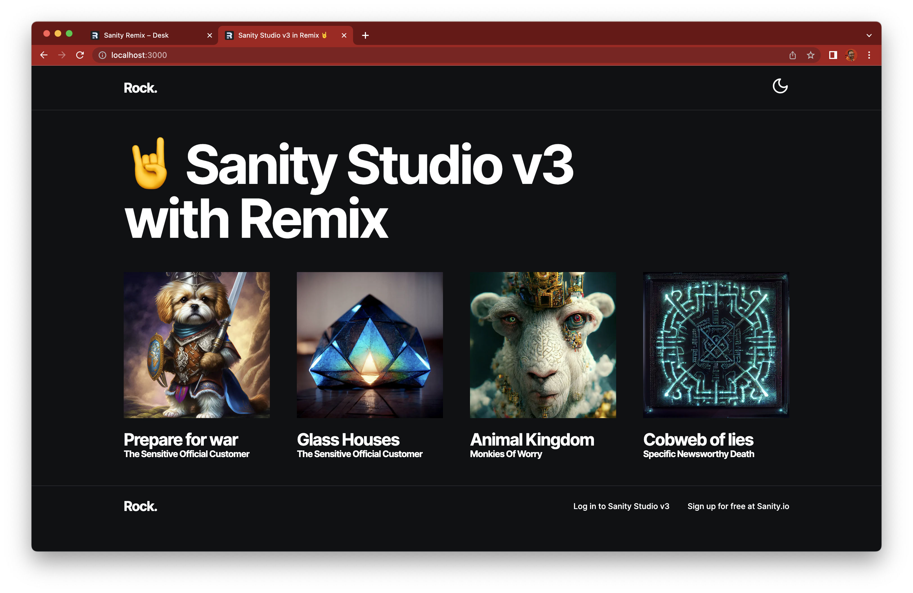

# Sanity Studio v3 + Remix

- [Sanity Studio v3 Docs](https://beta.sanity.io)
- [Remix Docs](https://remix.run/docs)



## Includes:

Useful Sanity examples with a light sprinkling of opinionated patterns

- Sanity Studio v3 embedded in the `/studio` route
- Styled Components SSR support for the `/studio` route
- Live Preview powered by [@sanity/preview-kit](https://github.com/sanity-io/preview-kit)
  -- An auto-generating, short-lived `secret` for guest previews
- Example Sanity Studio config and schema
- Example Portable Text Component using [@portabletext/react](https://github.com/portabletext/react-portabletext)
- Example Image Builder Component using [@sanity/image-url](https://github.com/sanity-io/image-url)
- Example custom decorated input "Duration" using [@sanity/ui](https://www.sanity.io/ui)
- Validated and Typed GROQ query results using [Zod](https://zod.dev/)
- eslint and Prettier
- Tailwind CSS with presets by [@sanity/demo](https://github.com/sanity-io/demo)
- Tailwind Prose and Prettier plugins

## Development

From your terminal:

```sh
npm run dev
```

This starts your app in development mode, rebuilding assets on file changes.

## Sanity Studio

Visit `https://localhost:3000/studio` in your Remix app. You will need to:

1. Rename `.env.template` to `.env`
2. Set the correct Project ID, Dataset Name and preferred API Version from a project in your [Sanity Manage](https://sanity.io/manage)
3. Add `http://localhost:3000` to the CORS settings on that project, with Allow Credentials privileges

## Deployment

First, build your app for production:

```sh
npm run build
```

Then run the app in production mode:

```sh
npm start
```

Now you'll need to pick a host to deploy it to.

### DIY

If you're familiar with deploying node applications, the built-in Remix app server is production-ready.

Make sure to deploy the output of `remix build`

- `build/`
- `public/build/`

### Using a Template

When you ran `npx create-remix@latest` there were a few choices for hosting. You can run that again to create a new project, then copy over your `app/` folder to the new project that's pre-configured for your target server.

```sh
cd ..
# create a new project, and pick a pre-configured host
npx create-remix@latest
cd my-new-remix-app
# remove the new project's app (not the old one!)
rm -rf app
# copy your app over
cp -R ../my-old-remix-app/app app
```
